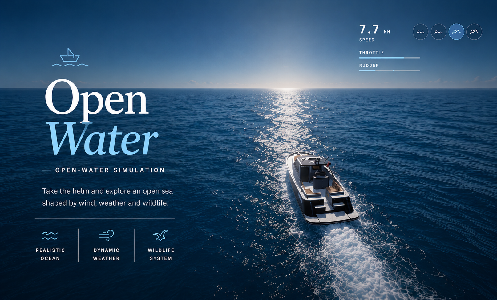

# Open Water



Browser-based 3D powerboat simulation. Vanilla Three.js (vendored, no build
step), hand-rolled physics.

## Requirements

- Docker and Docker Compose (the app is served as a static nginx container).
- A modern browser with WebGL2 (recent Chrome, Firefox, Safari, or Edge).
- Node.js 22 or newer for tests and validation.
- Python 3.12 or newer only when generating mobile boat variants.

## Run

```
docker compose up -d
```

→ http://localhost:8930

## Controls

- Z/W or Up arrow: throttle (the lever stays put)
- S or Down arrow: ease off / reverse
- Q/A and D or arrows: steering (self-centering)
- Space: throttle to zero
- C: cycle cameras (chase, helm, top-down, cinematic)
- 1-4: sea state (`Hs/Tp` shown in the HUD)
  - 1: `0.35 m / 4.5 s`
  - 2: `0.9 m / 5.4 s`
  - 3: `2.4 m / 6.1 s`
  - 4: `5.2 m / 6.4 s`
- B / Shift+B: next / previous boat
- R: reset

### Touch (mobile / tablet)

Auto-detected (`pointer: coarse`): a gesture control appears at the bottom
center and the keyboard shortcuts are hidden.

- Touch down inside the circle: the contact point becomes neutral.
- Drag up / down: forward / reverse; drag left / right: turn. The two axes
  combine and return to neutral on release.
- When not steering: one finger on the water to orbit, two fingers to pinch-zoom.
- While steering: a second finger on the water orbits horizontally, and its
  vertical motion adjusts zoom.
- Boat selector: full-width strip at the bottom, left/right arrows and horizontal swipe on mobile. Wave intensity: top right.

The render budget is trimmed on touch devices (fewer pixels, reduced shadows and
MSAA) to preserve the framerate. For textures, two safeguards:

- **runtime cap** at 1024² before the GPU upload (lowers sustained VRAM);
- **mobile variants** `assets/boats-mobile/*.glb` (textures ≤1024², geometry and
  materials unchanged), loaded first on touch devices with a fallback to the full
  model if missing.

The variant is essential for large GLBs: a model with 4096² textures is decoded
at **full resolution** by `GLTFLoader` (up to 512 MB transient for 8 textures)
*before* the runtime cap kicks in, so the tab crashes on mobile. The variant
removes that spike (~32 MB instead of 512).

> ⚠️ Any new boat with textures > 1024² must get its variant, or it will crash
> on mobile. Generate one with:
> `python3 tools/glb_shrink.py site/assets/boats/<x>.glb site/assets/boats-mobile/<x>.glb`

`#auto` at the end of the URL: self-driving demo.

### Adaptive quality and diagnostics

Quality is auto-selected from an initial profile, then adjusted with hysteresis
based on CPU/GPU frame times. The controller drives the internal resolution,
MSAA, bloom, shadows, the reflection and refraction passes, ocean density,
particles, rain, and the physics rate.

- `?quality=low|medium|high|ultra` locks a profile for comparison or testing.
- `?perf` shows real-time metrics (frame/CPU/GPU, draw calls, triangles).
- `?masks` renders the anti-water volumes as opaque neon green to spot where they
  poke out of the hulls.
- `?debug` exposes the documented runtime inspection API as `window.openWater`.
- Parameters combine, e.g. `?quality=low&perf`.

The in-game quality selector remembers the choice in `localStorage`. A `quality`
parameter in the URL takes priority for benchmarks and shared links.

Without `quality`, the mode stays automatic: downgrades are quick when the budget
is exceeded and upgrades deliberately slow to avoid oscillation.

On touch devices, the initial load uses a 1K half-float HDR, downloads audio only
after the start gesture, and loads only the active preset's wildlife. Wildlife
GLBs are decoded sequentially to avoid Safari/iOS memory spikes. Very heavy boats
without a mobile variant are not restored automatically, but stay manually
selectable.

### Achievements

A local achievement log tracks progress (speed, distance travelled, jumps,
dolphin escorts, whale/turtle encounters, etc.). Each unlock shows as a small
banner, and a panel summarizes the tiers. State persists in `localStorage`: no
account, no network calls.

## Technical

- **Ocean**: deterministic JONSWAP spectrum of 16 Gerstner waves, normalized to
  significant wave height `Hs` and peak period `Tp`, with their own phases and a
  secondary cross swell. Shared CPU/GPU computation, smoothed weather
  transitions, noise micro-ripples, procedural crest foam, normal flattening plus
  rising roughness with distance (specular anti-aliasing). PBR material extended
  via `onBeforeCompile`, lit by a `Sky` passed through PMREM.
- **Boat**: 6-DOF rigid body at a fixed step (240 Hz). Each model has its own
  physics sheet (mass, inertias, dimensions, propulsion, cameras, and effect
  anchors). Buoyancy over 8 hull points sampling the real wave (height, normal,
  and 3D orbital velocity), vectored thrust at the transom (cut when the
  propeller ventilates), drag computed relative to the water, planing lift with a
  moving center of pressure, heel in turns, and hydrodynamic roll restoring.
- **Effects**: hull spray spread across the physical contacts of the front third,
  transom turbulence and jets emitted from each real propeller (per-droplet
  size/alpha, fading on water contact), mist, turn spray thrown off the outer
  flank based on the maneuver's energy, impact plumes, and a persistent foam
  wake. Hull water displacement in the ocean shader (bow wave, trough, Kelvin
  V-wake).
- **Sky**: 4k Poly Haven HDRI (CC0) as backdrop plus IBL; sun direction and haze
  color extracted automatically from the file's pixels.
- **Rendering**: planar reflection of the boat in the water (mirror camera,
  dedicated layer) plus screen-space refraction of the submerged hull; PCF cast
  shadows; post-processing (4x MSAA, bloom, ACES output).
- **Audio**: hybrid Web Audio sound design. CC0 engine banks (shared between
  similar hulls), rpm and load interpolated in real time, spatialized engine and
  cavitation, multi-intensity rain and waves, real thunder sorted by distance
  with physical delay, ducking and limiter. Spatialized CC0 gull calls triggered
  by the presence of birds (none at the birdless sea background). In calm
  weather, parrots have their own real **CC0** calls (see `LICENSES.md`),
  spatialized per bird on a dedicated bus,
  with a synthesized procedural fallback if the files are missing. Wind, impacts,
  and the fallback layers stay procedural. Starts on the first interaction.
- **Wildlife** (per sea state): rigged GLB gulls (`SkeletonUtils` clones,
  flap/glide blended by `AnimationMixer`) that cross the sky in light seas, flee
  out to sea once it storms, and reflect in the water. Below the surface: coastal
  fish (boids-style schools plus solitary swimmers), rendered on the refraction
  layer to stay visible through the water, swimming animated by their GLB clip.
  Off-screen spawn/despawn, with density and species driven by the sea preset. In
  rough seas (`Rough`), escort dolphins come up from astern and ride the bow
  (bow-riding) as long as the boat holds 10-20 knots, then peel off when it slows.
  In a storm (`Storm`), a whale occasionally passes in the distance, its back
  breaking the surface ringed with foam, and blows a column of spray from its
  blowhole.
- **Lagoon (calm seas only)**: in `Calm`, the shallow, clear water reveals a
  **sandy bottom** (large plane rendered on the refraction layer, tinted by
  absorption, procedural rippling plus caustics) that follows the boat and blends
  into deep water via a radial gradient. Underwater: **starfish** resting on the
  sand (world-anchored, seeded in colonies of varied sizes, recycled off-screen
  to emerge smoothly), **turtles**, and **manta rays** gliding above, beating
  fins/wings. In the sky: small squadrons of **parrots** in flight, a bird system
  separate from the gulls (no gull calls).
  Everything fades out or heads offshore outside the `Calm` preset.
- **Moving parts**: the outboard and its existing propeller follow the RIB's
  steering and throttle; the Sea-Doo's handlebar and key use their GLB bones
  directly; the Ivory Horizon's twin propellers spin on their hubs and its
  existing flag becomes a French ensign on a continuous cloth grid, pinned along
  its whole blue edge to the mount then unfurled by the relative wind, with no
  overlaid visual prop. The Smolbot's outboard follows the steering, the Zodiac
  steers its two outboards (submerged propellers); on the S.S. Minnow III, the
  original propeller, rudder, and wheel are articulated despite the lack of pivots
  or bones in its GLB export. Frickie's Yacht flies a bitcoin stern ensign
  unfurled by the wind.
- **Fleet** (in-game label: source model; attribution and URL kept in each GLB's
  metadata):
  - **Azure Comet**: "ZEFIRO" by angelo raffaele catalano (Sketchfab, CC-BY-4.0).
    Also serves as the fallback model (`assets/boat.glb`) if the boat index is
    unreachable.
  - **Blackfin Vanguard**: "Assault Boat" by tnnv (Sketchfab, CC-BY-4.0). Mobile
    variant provided.
  - **Neon Manta**: "2012 Sea-Doo GTI SE 130" by BoatUS Foundation (Sketchfab,
    CC-BY-4.0). Mobile variant provided.
  - **Ivory Horizon**: "motoryacht 35" by angelo raffaele catalano (Sketchfab,
    CC-BY-4.0). Animated twin propellers and French ensign.
  - **Smolbot**: "Boat" by Firdaus Sahak (Sketchfab, CC-BY-4.0).
  - **S.S. Minnow III**: "SS Minnow III" by gogiart (Sketchfab, CC-BY-4.0). A
    38-foot Wheeler Playmate; propeller, rudder, wheel, and radar antenna
    articulated with no bones or pivots in the export.
  - **Zodiac**: "Zodiac boat" by RedC130 (Sketchfab, CC-BY-4.0). Small RIB
    ~5.5 m, lightweight SketchUp export (0 textures, ~93k vertices), no mobile
    variant needed.
  - **Frickie's Yacht**: "Frickie's Yacht" by KurumA (Sketchfab,
    **CC-BY-NC-4.0**, non-commercial use only). Superyacht ~78 m, the largest in
    the fleet; heavy geometry (43 interior meshes) with no mobile variant, bitcoin
    stern ensign.
- Heavy hulls without a mobile variant (Ivory Horizon, S.S. Minnow III, Frickie's
  Yacht) are not restored automatically on touch startup, but stay manually
  selectable.
- An articulated procedural outboard (`buildOutboard`) is available as a
  fallback, disabled by default; each model keeps its own powerplant.
- Wildlife, gull: "Flying Seagull" by geminga (Sketchfab, CC-BY-SA). Fish:
  Quaternius pack (CC0, poly.pizza). Attributions/URL kept in each GLB's
  metadata; specGloss models are converted to metallic-roughness for the vendored
  loader.
  - Turtle: "Model 50A - Hawksbill Sea Turtle" by DigitalLife3D (**CC-BY-NC-4.0**).
  - Manta ray: "Manta Ray (Birostris) animated" by Violaine (**CC-BY-NC-SA-4.0**).
  - Starfish: "Asteroid Starfish / Seastar" by Digital Atlas of Ancient Life
    (**CC0-1.0**). Procedural fallback if missing.
  - Whale: "Blue Whale - Textured" by Bohdan Lvov (**CC-BY-4.0**).
  - Dolphin: "Model 61A - Bottlenose Dolphin" by DigitalLife3D (**CC-BY-NC-4.0**).
  - Parrot: "Scarlet Macaw" by Mateus Schwaab (**CC-BY-4.0**).
  ⚠️ **Non-commercial** wildlife (turtle, manta, dolphin: NC).
  - Sea/gull sounds: see `site/assets/audio/LICENSES.md`.

## Project structure

```
site/                     Static app served by nginx
  index.html              Entry point (HUD, boot)
  js/                     ES modules, loaded directly (no build step)
    main.js               App loop, input, cameras, boat loading
    vessels.js            Per-boat physics / rig / effect specs
    boat.js               Rigid-body hull + GLB model loading
    vessel-animations.js  Propellers, flags, steering, nav lights
    ocean.js waves.js     Sea surface + JONSWAP spectrum
    weather.js            Weather transitions
    effects.js foamtrail.js seabed.js   Spray, wakes, lagoon floor
    fish.js birds.js dolphins.js whale.js manta.js turtles.js wildlife.js
                          Wildlife systems (per sea state)
    audio.js              Web Audio sound design
    achievements.js       Local achievement tracking
    performance.js        Adaptive quality controller
    deferred-loader.js    Sequential GLB decoding
  vendor/                 Vendored Three.js (three.module.js + addons)
  assets/
    boats/                Vessel GLBs + index.json
    boats-mobile/         Downscaled (<=1024 texture) variants
    animals/              Wildlife GLBs (fish/, birds, sea life)
    audio/                CC0 samples + LICENSES.md
    *.hdr                 Sky HDRIs (1k / 4k)
    ogimage.png           Social / hero image
tools/
  glb_shrink.py           Generate mobile texture variants
tests/                    Node unit and project-integrity tests
```

## Development

Install the pinned validation dependencies and run the complete local gate:

```sh
npm ci
python3 -m pip install -r requirements-tools.txt
npm run check
python3 -m ruff check tools
```

The suite contains more than 40 tests and enforces minimum coverage thresholds
for the unit-testable physics, configuration, and progression modules. GitHub
Actions runs JavaScript, HTML, Python, integrity, and coverage checks on every
push and pull request.

See [`CONTRIBUTING.md`](CONTRIBUTING.md) for review and asset-provenance rules,
and [`SECURITY.md`](SECURITY.md) for private vulnerability reporting.

## License

The source code in this repository is released under the MIT License (see
[`LICENSE`](LICENSE)).

The repository is a mixed-license distribution. The application source is MIT,
while bundled media retain their respective licenses:

- **Non-commercial** (CC-BY-NC / CC-BY-NC-SA): the turtle, manta ray, dolphin,
  and Frickie's Yacht. Fine for personal, non-commercial use only.
- Other media use CC0, CC-BY, or CC-BY-SA terms. Attribution is kept in each
  GLB's metadata and in `site/assets/audio/LICENSES.md`.

See [`THIRD_PARTY_NOTICES.md`](THIRD_PARTY_NOTICES.md) for the complete asset and
vendored-code inventory before reusing media outside this project.
